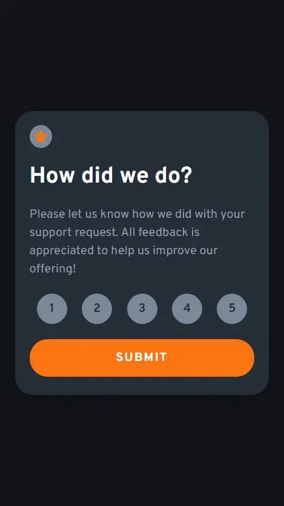
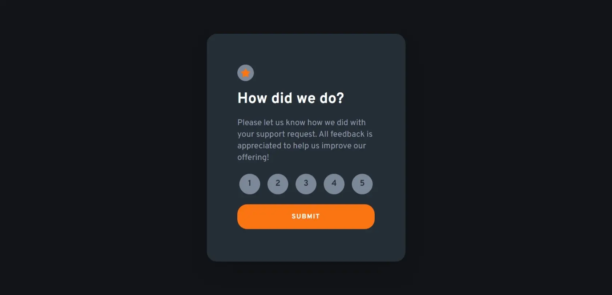
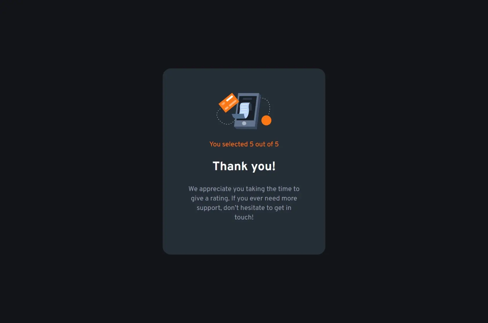

# Frontend Mentor - Interactive rating component solution

This is a solution to the [Interactive rating component challenge on Frontend Mentor](https://www.frontendmentor.io/challenges/interactive-rating-component-koxpeBUmI). Frontend Mentor challenges help you improve your coding skills by building realistic projects. 

## Table of contents

- [Overview](#overview)
  - [The challenge](#the-challenge)
  - [Screenshot](#screenshot)
  - [Links](#links)
- [My process](#my-process)
  - [Built with](#built-with)
  - [What I learned](#what-i-learned)
  - [Continued development](#continued-development)
  - [Useful resources](#useful-resources)
- [Author](#author)
- [Acknowledgments](#acknowledgments)

## Overview

### The challenge

Users should be able to:

- View the optimal layout for the app depending on their device's screen size
- See hover states for all interactive elements on the page
- Select and submit a number rating
- See the "Thank you" card state after submitting a rating

### Screenshot

### Links

- Solution URL: [GitHub](https://github.com/TuanAnh45468/interactive-rating-component)
- Live Site URL: [Netlify](https://interactive-rating-component-tuananh.netlify.app/)

## My process

### Built with

- Semantic HTML5 markup
- CSS custom properties
- Flexbox
- Mobile-first workflow
- [TailwindCSS](https://tailwindcss.com/) - For styles
### Useful resources

- [TailwindCSS](https://www.tailwindcss.com)
- [TailwindCSS cheatsheet](https://tailwindcomponents.com/cheatsheet/)

## Author

- Website - [My portfolio](https://tuananhportfolio.netlify.app/)
- Frontend Mentor - [@Tuananh45468](https://www.frontendmentor.io/profile/Tuananh45468)
- Twitter - [@yourusername](https://www.twitter.com/yourusername)